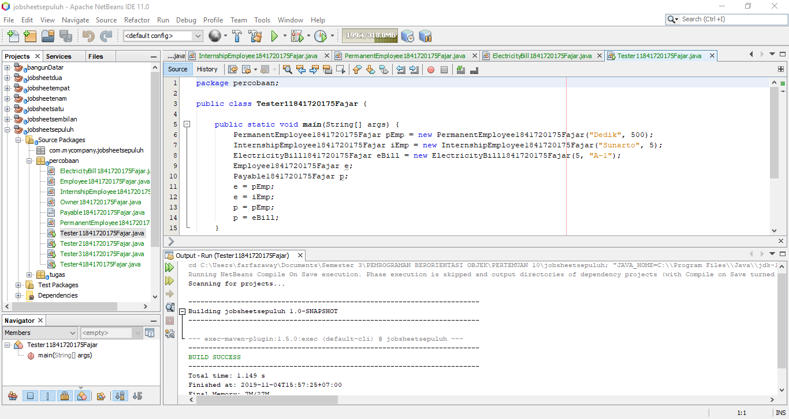
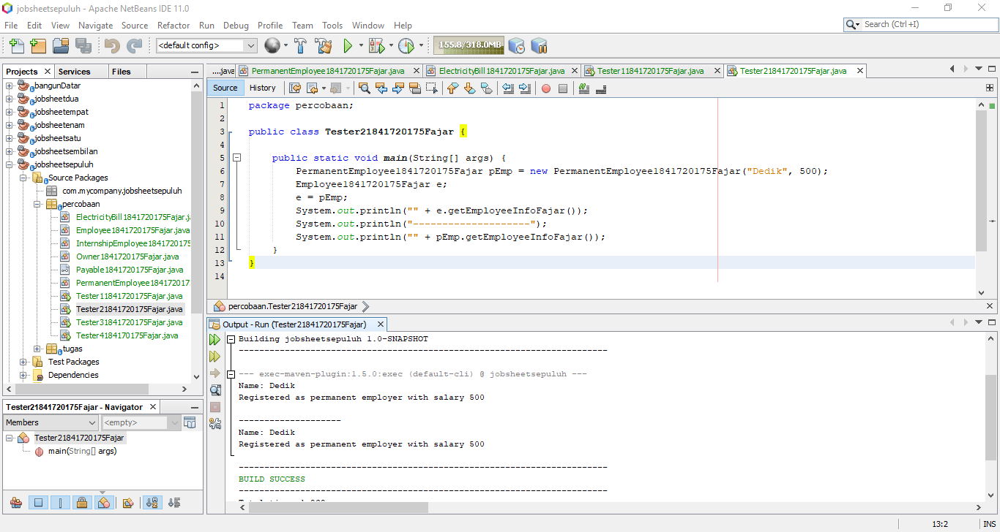
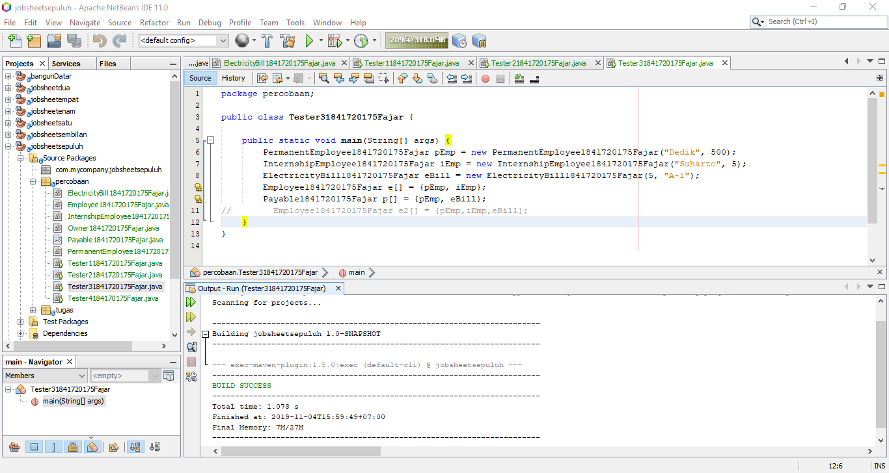
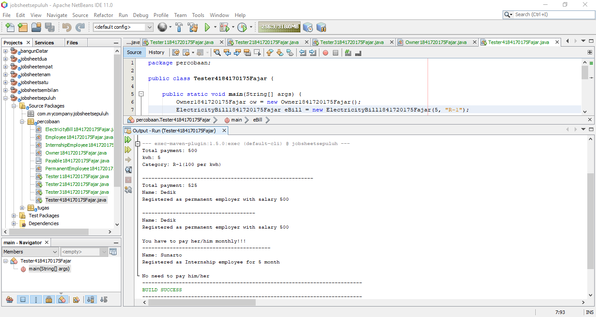
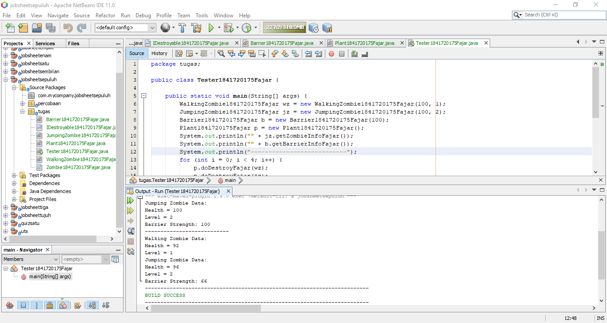

# Laporan Praktikum #10 - Polimorfisme

## Kompetensi

Setelah melakukan percobaan pada jobsheet ini, diharapkan mahasiswa mampu:

* Memahami konsep dan bentuk polimorfisme.
* Memahmai koneop virutal method invication.
* Menerapkan polimorfisme pada pembuatan heterogeneous collection.
* Menerapkan polimorfisme pada parameter/argument method.
* Menerapkan objek casting untuk mngubah bentuk objek.

## Ringkasan Materi

Polimorfisme

Polimorfisme adalah salah satu konsep dalam Object Oriented Programming (OOP) Java. Dengan menerapkan polimorfisme memungkinkan objek memiliki beberapa bentuk. Penggunaan polimorfisme yang paling umum dalam OOP terjadi ketika ada referensi super class yang digunakan untuk merujuk ke objek dari sub class. Dengan kata lain, ketika ada suatu objek yang dideklarasikan dari super class, maka objek tersebut bisa diinstansiasi sebagai objek dari sub class. Dari uraian tersebut bisa dilihat bahwa konsep polimorfisme bisa diterapkan pada class-class yang memiliki relasi inheritance (relasi generalisasi atau IS-A).

Selain pada class-class yang memiliki relasi inheritance, polimorfisme juga bisa diterapkan pada interface. Ketika ada objek yang dideklarasikan dari suatu interface, maka ia bisa digunakan untuk mereferensi ke objek dari class-class yang implements ke interface tersebut.

## Percobaan

### Percobaan 1 - Bentuk Dasar Polimorfisme

Link kode program Employee : [klik disini](../../src/10_Polimorfisme/percobaan/Employee1841720175Fajar.java)

Link kode program ElectricityBill: [klik disini](../../src/10_Polimorfisme/percobaan/ElectricityBill1841720175Fajar.java)

Link kode program InternshipEmployee: [klik disini](../../src/10_Polimorfisme/percobaan/InternshipEmployee1841720175Fajar.java)

Link kode program PermanentEmployee: [klik disini](../../src/10_Polimorfisme/percobaan/PermanentEmployee1841720175Fajar.java)

Link kode program Payable: [klik disini](../../src/10_Polimorfisme/percobaan/Payable1841720175Fajarr.java)

Link kode program Tester1: [klik disini](../../src/10_Polimorfisme/percobaan/Tester11841720175Fajar.java)

### Pertanyaan Percobaan 1

1. Class apa sajakah yang merupakan turunan dari class Employee?

    Class yang menjadi turunan dari class Employee adalah class InternshipEmployee dan PermanentEmployee

2. Class apa sajakah implements ke interface Payable?

    Class yang implemnets terhadap Payable adalah class PermanentEmployee dan ElectricityBill

3. Perhatikan class Tester 1, baris ke-10 dan 11. Mengapa e, bisa diisi dengan objek pEmp dan objek iEmp?

    Karena variable e adalah bertipe Employee yang menjadi parent dari class PermanentEmployee dan IntershipEmployee. Sehingga e bisa diisi objek pEmp dari class PermanentEmployee dan iEmp dari class InternshipEmployee.

4. Perhatikan class Tester1, baris ke-12 dan 13. Mengapa p, bisa diisi dengan objek pEmp dan objek eBill?

    Karena variable p adalah bertipe Payable yang dimana class PermanentEmployee dan ElectricityBill mengimplements interface Payable. Sehingga p bisa diisi objek pEmp dari class PermanentEmployee dan eBill dari class ElectricityBill.

5. Coba tambahkan sintaks:

    p = iEmp;
    e = eBill;

    Pada baris 14 dan 15 (baris terakhir dalam method main) ! Apa yang menyebabkan error?

    Yang menyebabkan error adalah class InternshipEmployee tidak mengimplements interface Payable dan class ElectricityBill tidak mengexetends class Employee.

6. Ambil kesimpulan tentang konsep/bentuk dasar polimorfisme!

    Konsep dasar polimorfisme adalah bagaiaman suatu objek dapat memiliki beberapa bentuk.

### Percobaan 2 - Virtual Method Invocation

Link kode program Tester2: [klik disini](../../src/10_Polimorfisme/percobaan/Tester21841720175Fajar.java)

### Pertanyaan Percobaan 2

1. Perhatikan class Tester2 di atas, mengapa pemanggilan e.getEmployeeInfo() pada baris 8 dan pEmp.getEmployeeInfo() pada baris 10 menghasilkan hasil sama?

    Karena terdapat kode program yang menyatakan bahwa e adalah sama dengen pEmp (objek dari kelas PermanentEmployee) yaitu e = pEmp.

2. Mengapa pemanggilan method e.getEmployeeInfo() disebut sebagai pemanggilan method virtual (virtual method invication, sedangkan pEmp.getEmployeeInfo() tidak?

    Karena pada pemanggilan method getEmployeeInfo() menggunakan objek e compiler akan mengenali method getEmployeeInfo() sebagai method yang terdapat di kelas Employee sedangkan pada saat dijalankan JVM akan mengenali method getEmployeeInfo() sebagai method yang terdapat pada kelas PermanentEmployee.

3. Jadi apakah yang dimaksud dari virtual method invocation? Mengapa disebut virtual?

    Disebut virutual karena method yang dikenali oleh compiler dan method yang dijalankan oleh JVM berbeda.

### Percobaan 3 - Heterogenous Collection

Link kode program Tester3: [klik disini](../../src/10_Polimorfisme/percobaan/Tester31841720175Fajar.java)

### Pertanyaan Percobaan 3

1. Perhatikan array e pada baris ke-8, mengapa ia bisa diisi dengan objek-objek dengan tipe yang berbeda, yaitu objek pEmp (objek dari PermanentEmployee) dan objek iEmp (objek dari InternshipEmployee)?

    Karena kelas PermanentEmployee dan InternshipEmployee mengextends kelas Employee sehingga array e bisa menyimpan objek-objek dari kelas tersebut.

2. Perhatikan juga baris ke-9, mengapa array p juga biisi dengan objekobjek dengan tipe yang berbeda, yaitu objek pEmp (objek dari PermanentEmployee) dan objek eBill (objek dari ElectricityBilling) ?

    Karena kelas PermanenetEmployee dan ElectricityBill mengimplements interface Payable sehingga array p bisa menyimpan objek-objek dari kelas tersebut.

3. Perhatikan baris ke-10, mengapa terjadi error?

    Terjadi error karena kelas ElectricityBill tidak mengextands kelas Employee sehingga array e2 yang bertipe Employee tidak bisa menyimpan objek eBill.

### Percobaan 4 - Argumen Polimorfisme, Instanceod dan Casting Objek

Link kode program Tester4: [klik disini](../../src/10_Polimorfisme/percobaan/Owner1841720175Fajar.java)

Link kode program : [klik disini](../../src/10_Polimorfisme/percobaan/Tester41841720175Fajar.java)

### Pertanyaan Percobaan 4 

1. Perhatikan class Tester4 baris ke-7 dan baris ke-11, mengapa pemanggilan ow.pay(eBill) dan ow.pay(pEmp) bisa dilakukan,  padahal jika diperhatikan method pay() yang ada di dalam class Owner memiliki argument/parameter bertipe Payable? Jika diperhatikan lebih detil eBill merupakan objek dari ElectricityBill dan pEmp merupakan objek dari PermanentEmployee?

    Karena kelas ElectricityBill dan PermanentEmployee mengimplements interface Payable sehingga objek-objek dari kedua kelas tersebut bisa dijadikan untuk mengisi suatu parameter yang memiliki tipe Payable pada suatu method.

2. Jadi apakah tujuan membuat argument bertipe Payable pada

method pay() yang ada di dalam class Owner?

    Tujuannya adalah agar semua kelas yang mengimplements interface Payable bisa digunakan untuk mengisi parameter.

3. Coba pada baris terakhir method main() yang ada di dalam class Tester4 ditambahkan perintah ow.pay(iEmp); Mengapa terjadi error?

    Terjadi error karena kelas InternshipEmployee tidak mengimplents interface Payable sehingga objeknya tidak bisa digunakan untuk mengisi nilai parameter method pay()

4. Perhatikan class Owner, diperlukan untuk apakah sintaks p

instanceof ElectricityBill pada baris ke-6 ?

    Sintaks tersebut digunakan untuk menyeleksi apakah nilai p yang dimasukkan apakah sama dengan ElectricityBill atau sama dengan PermanentEmployee. Nilai p akan bernilai sama dengan ElectricityBill jika yang dimasukkan adalah objek dari kelas ElectricityBill. Nilai p akan bernilai sama dengan PermanentEmployee jika objek yang dimasukkan adalah objek dari kelas PermanentEmployee.

5. Perhatikan kembali class Owner baris ke-7, untuk apakah casting objek disana (ElectricityBill eb = (ElectricityBill) p)

diperlukan ? Mengapa objek p yang bertipe Payable harus di-casting ke dalam objek eb yang bertipe ElectricityBill ?

    Proses casting tersebut diperlukan untuk mengakses method billGetInfo().

## Tugas

Link kode program Zombie: [klik disini](../../src/10_Polimorfisme/tugas/Zombie1841720175Fajar.java)

Link kode program Walking Zombie: [klik disini](../../src/10_Polimorfisme/tugas/WalkingZombie1841720175Fajar.java)

Link kode program Jumping Zombie: [klik disini](../../src/10_Polimorfisme/tugas/JumpingZombie1841720175Fajar.java)

Link kode program Barrier: [klik disini](../../src/10_Polimorfisme/tugas/Barrier1841720175Fajar.java)

Link kode program Destroyable: [klik disini](../../src/10_Polimorfisme/tugas/IDestroyable1841720175Fajar.java)

Link kode program Plant: [klik disini](../../src/10_Polimorfisme/tugas/Plant1841720175Fajar.java)

Link kode program Tester: [klik disini](../../src/10_Polimorfisme/tugas/Tester1841720175Fajar.java)

## Kesimpulan

Dapat didefinisikan kembali bahwa polymorphism adalah kemampuan untuk menghasilkan sesuatu yang berbeda dengan cara yang sama.

## Pernyataan Diri

Saya menyatakan isi tugas, kode program, dan laporan praktikum ini dibuat oleh saya sendiri. Saya tidak melakukan plagiasi, kecurangan, menyalin/menggandakan milik orang lain.

Jika saya melakukan plagiasi, kecurangan, atau melanggar hak kekayaan intelektual, saya siap untuk mendapat sanksi atau hukuman sesuai peraturan perundang-undangan yang berlaku.

Ttd, 

Fajar Pandu

