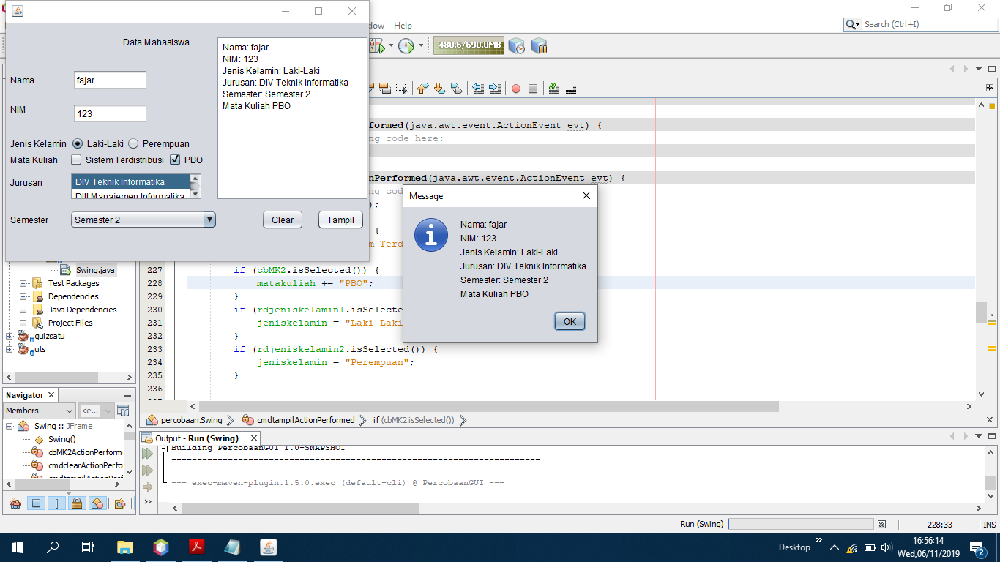

# Laporan Praktikum #11 - GUI (Graphical User Interface)

## Kompetensi

Setelah menyelesaikan lembar kerja ini mahasiswa diharapkan mampu:

1. Membuat aplikasi graphical user interface sederhana dengan bahasa pemrograman Java.
2. Mengenal komponen GUI seperti frame, label, textfield, combobox, radiobutton, checkbox, textarea, menu, serta table.
3. Menambahkan event handling pada aplikasi GUI.

## Ringkasan Materi

Java AWT (Abstract Window Toolkit)

Java AWT adalah sebuah API (Application Programming Interface) untuk membuat sebuah GUI aplikasi berbasis window dengan bahasa pemrograman Java.

Java Swing

Java Swing merupakan bagian dari JFC (Java Foundation Classes) yang menyediakan API untuk menangani hal yang berkaitan dengan GUI bagi program Java.

Java Swing

sumber gambar: https://www.guru99.com/java-swing-gui.html

Perbedaan Java AWT dengan Java Swing

sumber gambar: https://www.javatpoint.com/java-swing

## Percobaan

### Percobaan 1

Link kode program HelluGUI: [Klik disini](../../src/11_GUI/percobaan/HelloGui1841720175Fajar.java)

### Percobaan 2

Link kode program MyInputFrom: [Klik disini](../../src/11_GUI/percobaan/MyInputForm1841720175Fajar.java)

### Pertanyaan 2

a) Modifikasi kode program dengan menambahkan JButton baru untuk melakukan fungsi perhitungan penambahan, sehingga ketika button di klik (event click) maka akan menampilkan hasil penambahan dari nilai A dan B

### Percobaan 3

Link kode program Border: [ Klik disini](../../src/11_GUI/percobaan/Border1841720175Fajar.java)

Link kode program Box: [ Klik disini](../../src/11_GUI/percobaan/Box1841720175Fajar.java)

Link kode program Grid: [ Klik disini](../../src/11_GUI/percobaan/Grid1841720175Fajar.java)

Link kode program LayoutGUI: [ Klik disini](../../src/11_GUI/percobaan/LayoutGui1841720175Fajar.java)

### Pertanyaan 3

a) Apa perbedaan dari Grid Layout, Box Layout dan Border Layout?

Grid layout membagi window dengan jumlah kolom dan baris dengan jumlah yang sudah ditentukan.
Box layout akan menampilkan button dengan bentuk kotak-kotak.
Border layout membagi window menjadi empat bagian yaitu north, west, east, dan south.

b) Apakah fungsi dari masing-masing kode berikut?

JFrame frame = new Border1841720175Fajar();
frame.setDefaultCloseOperation(JFrame.EXIT_ON_CLOSE);
frame.setVisible(true);

Kode diatas digunakan untuk membuat objek baru dengan frame dari kelas Border. Kemudian baris kode dibawahnya digunakan untuk memberikan perintah ketika tombol close diklik maka program akan dihentikan. Baris terakhir kode diatas digunakan untuk menampilkan frame.

### Percobaan 4

Link kode program Swing: [ Klik disini](../../src/11_GUI/percobaan/Swing.java)
/Swing.java)

### Pertanyaan 4

a) apakah fungsi dari kode berikut?

java.awt.EventQueue.invokeLater(new Runnable() {
public void run() {
new Swing().setVisible(true);
}

Kode program di atas digunakan untuk membuat dan menampilkan form.

b) Mengapa pada bagian logika checkbox dan radio button digunakan multiple if ?

Karena setiap pilihan pada checkbox dan radio button akan menghasilkan output yang berbeda.

c) Lakukan modifikasi pada program untuk melakukan menambahkan inputan berupa alamat dan berikan fungsi pemeriksaan pada nilai Alamat tersebut jika belum diisi dengan menampilkan pesan peringatan

### Percobaan 5

Link kode program Swing2: [Klik disini](../../src/11_GUI/percobaan/Swing2.java)

### Pertanyaan 5

a) Apa kegunaan komponen swing JTabPane, JTtree, pada percobaan 5?

JTabPane digunakan untuk memudahkan user untuk berpindah dari suatu kelompok komponen satu ke kelompok komponen lainnya.

Jtree digunakan untuk menampilkan sekumpula hierarki data.

b) Modifikasi program untuk menambahkan komponen JTable pada tab Halaman 1 dan tab Halaman 2

## Tugas

Buatlah Sebuah Program yang mempunyai fungsi seperti kalkulator (mampu menjumlahkan, mengurangkan, mengalikan dan membagikan.

Link kode program Calculator: [ini contoh link ke kode program](../../src/11_GUI/tugas/Calculator.java)

## Kesimpulan

Dengan memanfaatkan GUI tampilan sebuah aplikasi bisa lebih baik dan meminimalisir kesalahan oleh pengguna.

## Pernyataan Diri

Saya menyatakan isi tugas, kode program, dan laporan praktikum ini dibuat oleh saya sendiri. Saya tidak melakukan plagiasi, kecurangan, menyalin/menggandakan milik orang lain.

Jika saya melakukan plagiasi, kecurangan, atau melanggar hak kekayaan intelektual, saya siap untuk mendapat sanksi atau hukuman sesuai peraturan perundang-undangan yang berlaku.

Ttd,

Fajar Pandu
