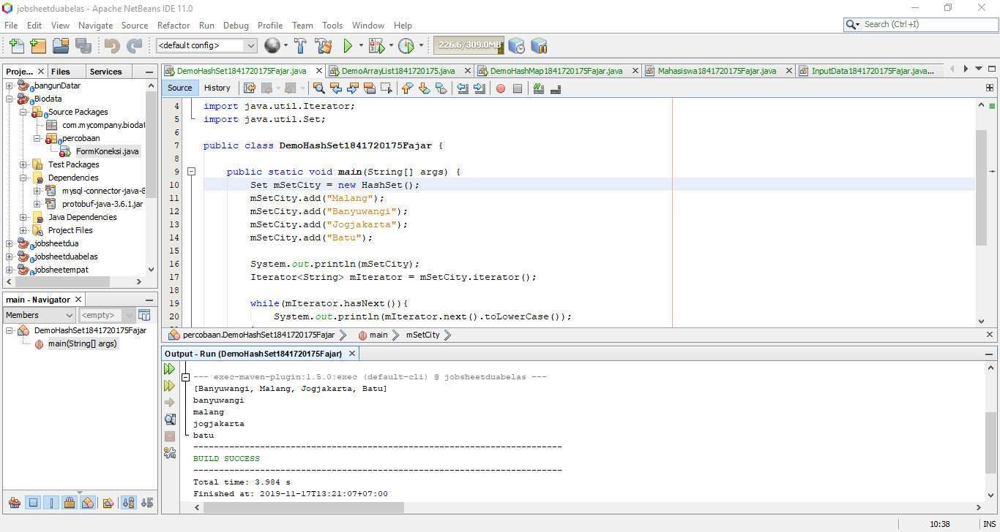
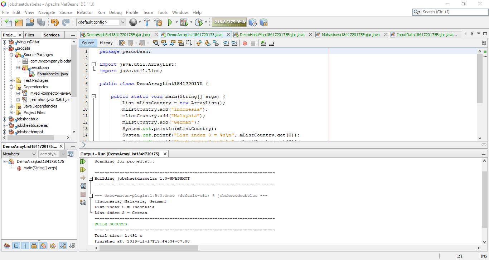
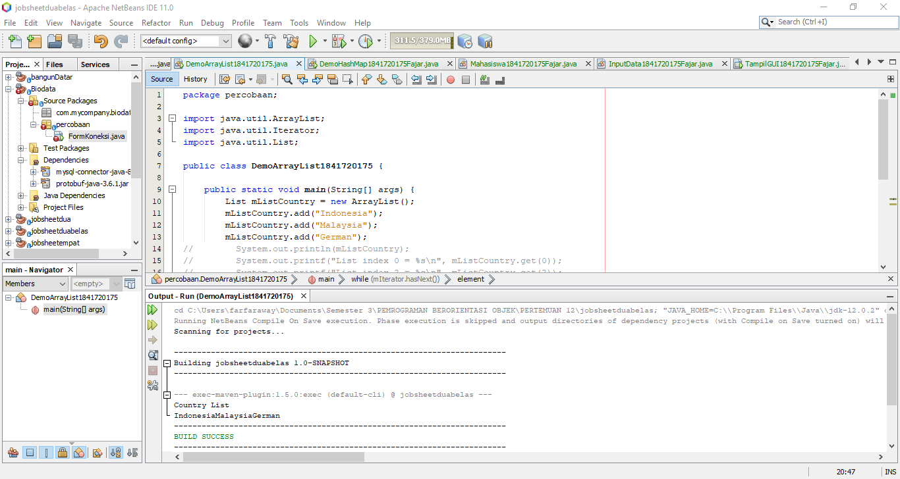
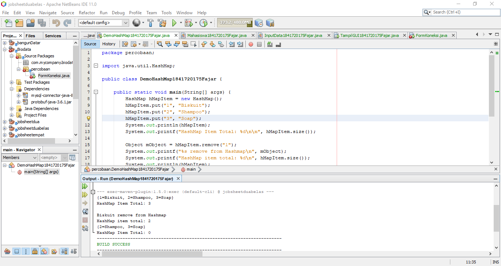
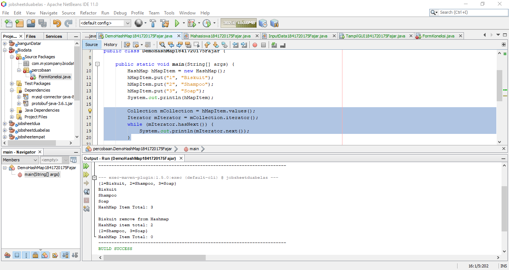
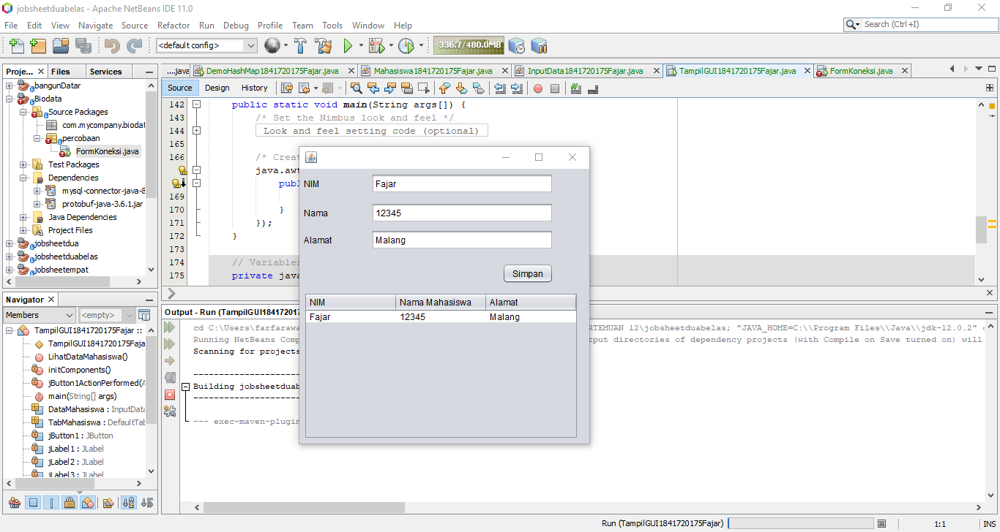
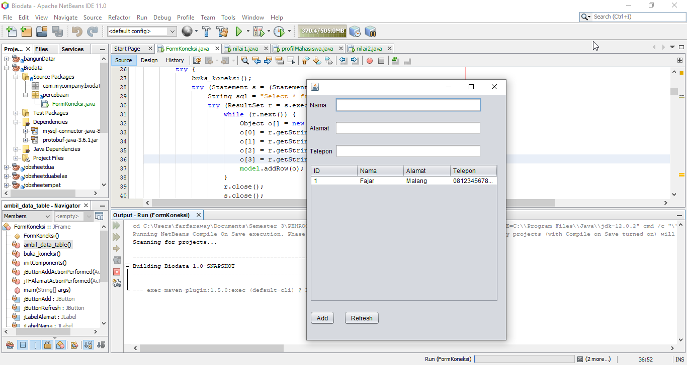
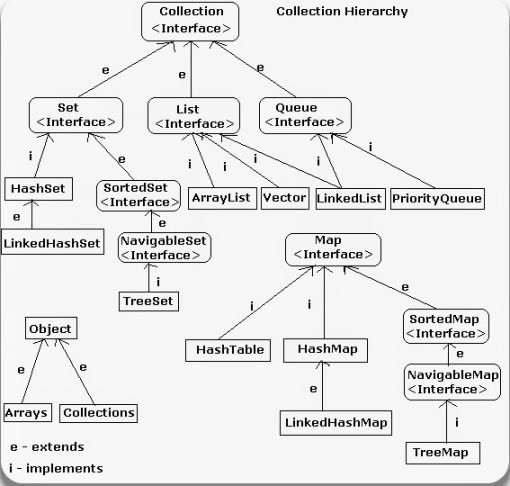

# Laporan Praktikum #12 - Collection (List, Set, Map) dan Database

## Kompetensi

Tujuan Pembelajaran

1. Memahami cara penyimpanan objek menggunakan Collection dan Map.
2. Mengetahui pengelompokan dari Collection.
3. Mengetahui perbedaan dari interface Set, List dan Map.
4. Mengetahui penggunaan class-class dari interface Set, List, dan Map.
5. Memahami koneksi database menggunakan JDBC dan JDBC API

## Ringkasan Materi

Collection adalah suatu objek yang bisa digunakan untuk menyimpan sekumpulan objek. Objek yang ada dalam Collection disebut elemen. Collection menyimpan elemen yang bertipe Object, sehingga berbagai tipe object bisa disimpan dalam Collection. Class-class mengenai Collection tergabung dalam Java Collection Framework. Class-class Collection diletakkan dalam package java.util dan mempunyai dua interface utama yaitu Collection.

1. Set

Set mengikuti model himpunan, dimana objek/anggota yang tersimpan dalam Set harus unik. Urutan maupun letak dari anggota tidak penting, hanya keberadaan anggota saja yang penting. Kelas konkrit yang mengimplementasikan Set harus memastikan bahwa tidak terdapat elemen duplikat yang dapat ditambahkan ke dalam set. Yaitu, tidak terdapat dua elemen e1 dan e2 yang berada di dalam set yang membuat e1.equals(e2) bernilai true. Class- Class yang mengimplementasikan interface Set adalah HashSet.

2. List

List digunakan untuk menyimpan sekumpulan objek berdasarkan urutan masuk (ordered) dan menerima duplikat. Cara penyimpanannya seperti array, oleh sebab itu memiliki posisi awal dan posisi akhir, menyisipkan objek pada posisi tertentu, mengakses dan menghapus isi list, dimana semua proses ini selalu didasarkan pada urutannya. Class-class yang mengimplementasikan interface List adalah Vector, Stack, Linked List dan Array List.

3. Map

Perbedaaan mendasar map dengan collection yang lain, untuk menyimpan objek pada Map, perlu sepasang objek, yaitu key yang bersifat unik dan nilai yang disimpan. Untuk mengakses nilai tersebut maka kita perlu mengetahui key dari nilai tersebut. Map juga dikenal sebagai dictionary/kamus. Pada saat menggunakan kamus, perlu suatu kata yang digunakan untuk pencarian. Class-class yang mengimplementasikan Map adalah Hashtable,HashMap, dan LinkedHashMap.

## Percobaan

### Percobaan 1 - HashSet

Link kode program DemoHashSet: [Link ke kode program](../../src/12_Java_API/DemoHashSet1841720175Fajar.java)

### Pertanyaan 1

1.  Apakah fungsi i import java.util.\*; pada program diatas!

2.  Pada baris program keberapakah yang berfungsi untuk menciptakan object HashSet?

    Objek HashSet dibuat dengan menuliskan kode program berikut:

    Set mSetCity = new HashSet();

3.  Apakah fungsi potongan program dibawah ini pada percobaan 1!

    mSetCity.add("Malang");

    mSetCity.add("Banyuwangi");

    mSetCity.add("Jogjakarta");

    mSetCity.add("Batu");

    Kode program di atas digunakan untuk mengisi elemen-elemen pada HashSet dengan nama-nama kota.

4) Tambahkan set.add(“Malang”); kemudian jalankan program! Amati hasilnya dan jelaskan mengapa terjadi error!

   Terjadi error karena tidak ada variable atau objek dengan nama set.

5) Jelaskan fungsi potongan program dibawah ini pada percobaan 1!

   Iterator<String> mIterator = mSetCity.iterator();

   while(mIterator.hasNext()){
   System.out.println(mIterator.next().toLowerCase());
   }

   Iterator digunakan untuk melakukan perulangan untuk membaca data-data yang terdapat pada objek HashSet msetcity.

### Percobaan 2 - List

Link kode program DemoArrayList: [Link ke kode program](../../src/12_Java_API/DemoArrayList1841720175.java)

### Pertanyaan 2

1. Apakah fungsi potongan program dibawah ini!

   System.out.println(mListCountry);

   System.out.printf("List index 0 = %s\n", mListCountry.get(0));

   System.out.printf("List index 2 = %s\n", mListCountry.get(2));

   Kode program diatas digunakan untuk menampilkan semua data-data pada objek ArrayList mListCountry dan menampilkan hanya pada indeks ke-0 dan ke-2

2. Ganti potongan program pada soal no 1 menjadi sebagai berikut! Kemudian jalankan program tersebut!

3. Jelaskan perbedaan menampilkan data pada ArrayList menggunakan potongan program pada soal no 1 dan no 2!

   Ketika menggunakan kode program no 1 maka yang ditampilkan adalah dengan menampilkan semua data-data yang ada di mListCountry sedangkan jika menggunakan kode program no 2 maka yang ditampilkan adalah masing-masing data diambil dan disimpan di dalam object elemen kemudian ditampilkan.

### Percobaan 3 - Map

Link kode program DemoHashMap: [Link ke kode program](../../src/12_Java_API/DemoHashMap1841720175Fajar.java)

### Pertanyaan 3

1. Jelaskan fungsi hMapItem.put("1","Biskuit") pada program!

2. Jelaskan fungsi hMapItem.size() pada program!

   Fungsi hMapItem.size() adalah mengembalikan nilai dengan jumlah sebanyak data yang dimasukkan ke dalam HashMap

3. Jelaskan fungsi hMapItem.remove("1") pada program!

   Fungsi hMapItem.remove("1) adalah untuk menghapus data yang ada di hMapItem dengan key = 1.

4. Jelaskan fungsi hMapItem.clear() pada program!

   Fungsi hMapItem.claer() adalah untuk menghapus data-data yang ada di hMapItem.

5. Tambahkan kode program yang di blok pada program yang sudah anda buat!

   Collection mCollection = hMapItem.values();
   Iterator mIterator = mCollection.iterator();
   while (mIterator.hasNext()) {
   System.out.println(mIterator.next());
   }

6. Jalankan program dan amati apa yang terjadi!

7. Apakah perbedaan program sebelumnya dan setelah ditambahkan kode program pada soal no 5 diatas? Jelaskan!

   Setelah ditambahkan kode program sesuai no 5 terdapat perbedaan yaitu ditampilkannya data-data pada hMapItem tanpa key dan hanya valuenya saja.

### Percobaan 4

Link kode program Mahasiswa: [Link ke kode program](../../src/12_Java_API/Mahasiswa1841720175Fajar.java)

Link kode program InputData: [Link ke kode program](../../src/12_Java_API/InputData1841720175Fajar.java)

### Percobaan 5

Link kode program : [Link ke kode program](../../src/12_Java_API/Contoh12345Habibie.java)

### Pertanyaan 5

1. Setelah menambah code pada action button klik, coba jalankan program dan tambahkan data. Apakah program berhasil menambahkan data? Jika tidak apakah penyebabnya.

2) Jelaskan maksud source code untuk melakukan insert data diatas?

   Source code untuk melakukan insert data dilakukan dengan membuat variable sqlkode yang berisi query insert untuk kemudian query tersebut dikesekusi cukup dengan memanggil variable sqlkode tersebut.

3) Jelaskan alur dari method ambil_data_tabel?

4. Buat fungsi untuk merefresh sehingga data yang baru dapat ditampilkan pada tabel.

   Untuk merefresh data baru perlu ditambahkan kode ambil_data_table(); pada jButtonRefreshActionPerformed

## Kesimpulan

Collection adalah sebuah framework yang dibuat untuk menyimpan dan memanipulasi sebuah objek. Collection biasanya digunakan pada sebuah data seperti keperluan pencarian, pengurutan, input dan menghapus. Kerangka kerja (Framework) tersedia dalam bentuk Interface seperti Set, List, Map, dan lain-lain. Berikut adalah hierarki Java Collection

sumber: : http://onestringlab.com/belajar-java-collections/

## Pernyataan Diri

Saya menyatakan isi tugas, kode program, dan laporan praktikum ini dibuat oleh saya sendiri. Saya tidak melakukan plagiasi, kecurangan, menyalin/menggandakan milik orang lain.

Jika saya melakukan plagiasi, kecurangan, atau melanggar hak kekayaan intelektual, saya siap untuk mendapat sanksi atau hukuman sesuai peraturan perundang-undangan yang berlaku.

Ttd,

Fajar Pandu
