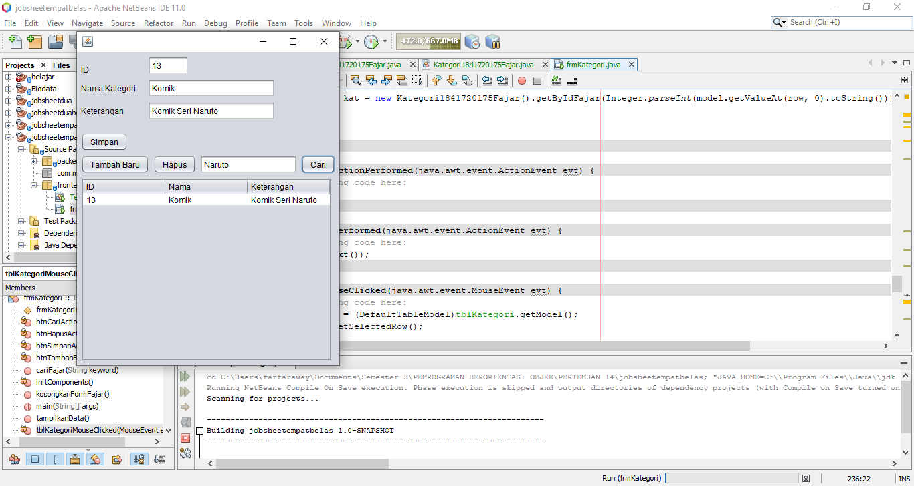

# Laporan Praktikum #14 - GUI dan Database

## Kompetensi

Setelah menempuh materi percobaan ini, mahasiswa mampu mengenal:

1. Menggunakan paradigma berorientasi objek untuk interaksi dengan database
2. Membuat backend dan frontend
3. Membuat form sebagai frontend

## Ringkasan Materi

1. JDBC (Java Database Connectivity) 

    JDBC (Java database connectivity) adalah spesifikasi standar dari JavaSoft API (Aplication Programming Interface) yang memungkinkan program Java untuk mengakses sistem database manajemen. JDBC API terdiri dari satu set interface dan kelas yang ditulis dalam bahasa pemrograman Java

2. ArrayList

    ArrayList merupakan collection yang menjadi bagian dari Java Util. ArrayList dapat menambah data baru secara dinamis tanpa harus menentukan ukurannya di awal.

3. Swing

    Java Swing adalah sekumpulan kelas-kelas yang digunakan untuk mengembangkan aplikasi berbasis GUI (Graphical User Interface). Java Swing merupakan versi peningkatan dari AWT (Abstract Window Toolkit).

## Percobaan

### Percobaan Kategori

Link kode program : [klik disini](../../src/14_GUI_dan_Database/TestBackend1841720175Fajar.java)

Link kode program : [klik disini](../../src/14_GUI_dan_Database/frmKategori1841720175Fajar.java)

Link kode program : [klik disini](../../src/14_GUI_dan_Database/frmKategori1841720175Fajar.form)

### Percobaan Anggota

Link kode program : [klik disini](../../src/14_GUI_dan_Database/TestBackendAnggota1841720175Fajar.java)

Link kode program : [klik disini](../../src/14_GUI_dan_Database/frmAnggota1841720175Fajar.java)

Link kode program : [klik disini](../../src/14_GUI_dan_Database/frmAnggota1841720175Fajar.form)

## Kesimpulan

DriverManager: Adalah sebuah class yang mengelola dirver;

Driver: Adalah interface yang menangani komunikasi dengan database.

Connection: Adalah interface yang menyediakan method untuk menghubungi database;

Statement: Adalah inteface untuk mengeksekusi query;

ResultSet: Adalah interface untuk menampung data hasil query

## Pernyataan Diri

Saya menyatakan isi tugas, kode program, dan laporan praktikum ini dibuat oleh saya sendiri. Saya tidak melakukan plagiasi, kecurangan, menyalin/menggandakan milik orang lain.

Jika saya melakukan plagiasi, kecurangan, atau melanggar hak kekayaan intelektual, saya siap untuk mendapat sanksi atau hukuman sesuai peraturan perundang-undangan yang berlaku.

Ttd,

Fajar Pandu Waskito
