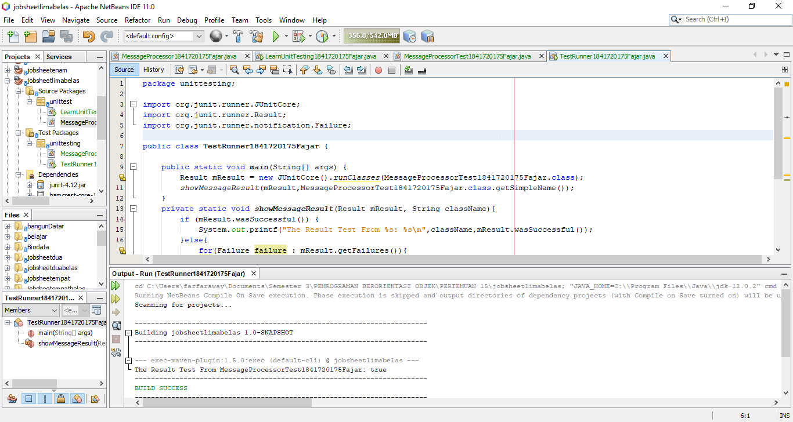
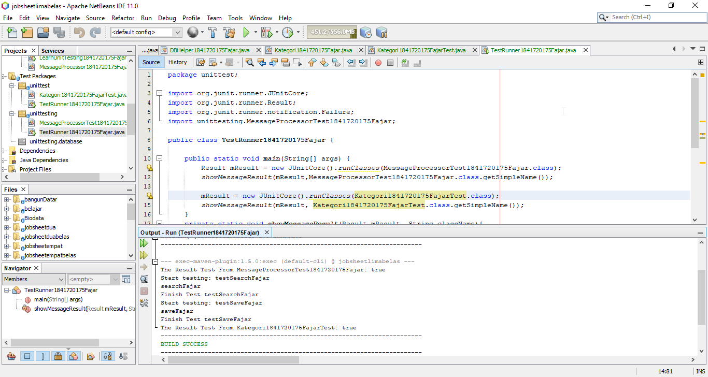

# Laporan Praktikum #15 - Unit Testing

## Kompetensi

Setelah menyelesaikan lembar kerja ini mahasiswa diharapkan mampu:

1. Memahami konsep dan fungsi unit testing
2. Menerapkan unit testing dengan JUnit pada program sederhana.
3. Menerapkan unit testing dengan JUnit pada progam yang terkoneksi database

## Ringkasan Materi

Unit Testing adalah suatu metode untuk melakukan pengecekan (testing) perangkat lunak dengan cara menguji setiap method/fungsi menggunakan sekumpulan modul program,prosedur penggunaan, dan prosedur pengoperasian untuk mengethaui apakah program sudah berjalan sebagaimana mestinya atau belum.

## Percobaan

### Percobaan 1

Link kode program TestRunner: [Link ke kode program](../../src/15_Unit_Testing/src/test/java/unittest/TestRunner1841720175Fajar.java)

### Percobaan 2

Link kode program TestRunner: [Link ke kode program](../../src/15_Unit_Testing/src/test/java/unittesting/TestRunner1841720175Fajar.java)

## Kesimpulan

Prinsip utama JUnit adalah dengan membuat test class untuk setiap class yang buat.

## Pernyataan Diri

Saya menyatakan isi tugas, kode program, dan laporan praktikum ini dibuat oleh saya sendiri. Saya tidak melakukan plagiasi, kecurangan, menyalin/menggandakan milik orang lain.

Jika saya melakukan plagiasi, kecurangan, atau melanggar hak kekayaan intelektual, saya siap untuk mendapat sanksi atau hukuman sesuai peraturan perundang-undangan yang berlaku.

Ttd,

Fajar Pandu
