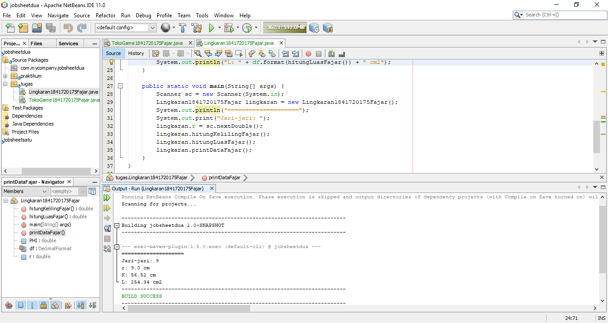

# Laporan Praktikum #2 - Class dan Object 

## Kompetensi
- Mahasiswa dapat memahami deskripsi dari class dan object.
- Mahasiswa memahami implementasi dari class.
- Mahasiswa dapat memahami implementasi dari attribute.
- Mahasiswa dapat memahami implementasi dari method.
- Mahasiswa dapat memahami implementasi dari proses instansiasi.
- Mahasiswa dapat memahami implementasi dari try-catch.
- Mahasiswa dapat memahami proses pemodelan class diagram. menggunakan UML

## Ringkasan Materi

1. Method

    Method adalah sebuah blok program terpisah yang digunakan untuk menyelesaikan masalah tertentu. Struktur method:
    
    modifier returnType namaMethod (parameter){
        //isi method
    }
    - modifier: digunakan untuk menentukan hak ases terhadap method
    - returnType: return type ada dua yaitu void dan return
    - namaMethod: nama method
    - parameter: digunakan untuk mengoper sebuah nilai
2. Object

    Proses pembuatan object dari suatu class disebut instansiasi dengan ditandai dengan kata kunci new.
3. Try-catch

    Try-catch adalah statement yang akan dieksekusi ketika suatu kode program dimana kode program tersebut akan menghasilkan output error jika salah satu atau beberapa komponen yang dibutuhkannya tidak terpenuhi.

4. Class Diagram 

    Class Diagram adalah diagram yang digunakan untuk menampilkan atribut-atribut beserta tipe datanya dan method-method yang digunakan dalam suatu class.

## Percobaan

### Percobaan 1 - Membuat Class Diagram

Dalam suatu perusahaan salah satu data yang diolah adalah data karyawan. Setiap karyawan memiliki id, nama, jenis kelamin, jabatan, jabatan, dan gaji. Setiap karyawan juga bisa menampilkan data diri pribadi dan melihat gajinya.

### Percobaan 2 - Membuat dan Mengakses Anggota Suatu Class

Link kode program : [Link ke kode program](../../src/2_Class_dan_Object/percobaan/Mahasiswa1841720175Fajar.java)

Link kode program main: [Link ke kode program](../../src/2_Class_dan_Object/percobaan/TestMahasiswa1841720175Fajar.java)

### Percobaan 3 - Menulis Method yang Memiliki Argument dan Return

Link kode program : [Link ke kode program](../../src/2_Class_dan_Object/percobaan/Barang1841720175Fajar.java)

Link kode program main: [Link ke kode program](../../src/2_Class_dan_Object/percobaan/TestBarang1841720175Fajar.java)

## Pertanyaan

1. Jelaskan pada bagian mana proses pendeklarasian atribut pada program Mahasiswa!

    pendeklarasian atribut dimulai pada potongan kode program berikut:

    public int nim;

    public String nama;

    public String alamat;

    public String kelas;

2. Jelaskan pada bagian mana proses pendeklarasian method pada program Mahasiswa!

    Pendeklarasian method dimulai pada potongan kode berikut:

    public void tampilBiodataFajar(){

        System.out.println("NIM\t: " + nim);

        System.out.println("Nama\t: " + nama);

        System.out.println("Alamat\t: " + alamat);
        
        System.out.println("Kelas\t: " + kelas);
    }

3. Berapa banyak objek yang di instansiasi pada program Mahasiswa!

    Banyak objek yang di instansiasi adalah satu yaitu mhs1.

4. Apakah yang sebenarnya dilakukan pada sintaks program “mhs1.nim=101” ?

    Mengisi atribut nim pada objek mhs1 dengan nilai 101.

5. Apakah yang sebenarnya dilakukan pada sintaks program “mhs1.tampilBiodata()”?

    Memanggil method tampilBiodata() pada kelas MahasiswaMahasiswa1841720175Fajar.

6. Instansiasi 2 objek lagi pada program Mahasiswa!

7. Apakah fungsi argumen dalam suatu method?

    Argumen digunakan untuk mendeklarasi atribut yang dibutuhkan di dalam method tersebut dimana atribut tersebut nilainya adalah hasil input baik dari user maupun program tersebut.

8. Ambil kesimpulan tentang kegunaan dari kata kunci return, dan kapan suatu method harus memiliki return!

    Return digunakan untuk mengembalikan nilai pada suatu method untuk nilai tersebut digunkan kembali. Return digunakan ketika method yang digunakan adalah memiliki tipe data.

## Tugas

### Tugas 1

Link kode program : [Link ke kode program](../../src/2_Class_dan_Object/tugas/TokoGame1841720175Fajar.java)

### Tugas 2

Link kode program : [Link ke kode program](../../src/2_Class_dan_Object/tugas/Karyawan1841720175Fajar.java)

### Tugas 3

Link kode program : [Link ke kode program](../../src/2_Class_dan_Object/tugas/Lingkaran1841720175Fajar.java)

### Tugas 4

Link kode program : [Link ke kode program](../../src/2_Class_dan_Object/tugas/Barang1841720175Fajar.java)

## Kesimpulan

Dalam pendeklarasian atribut perlu memperhatikan access modifier untuk membatasi resource-resourcce mana saja yang dapat diakses oleh object tertentu.

Proses pembuatan object dari suatu class disebut instansiasi dengan ditandai dengan kata kunci new.

Class Diagram adalah diagram yang digunakan untuk menampilkan atribut-atribut beserta tipe datanya dan method-method yang digunakan dalam suatu class.

## Pernyataan Diri

Saya menyatakan isi tugas, kode program, dan laporan praktikum ini dibuat oleh saya sendiri. Saya tidak melakukan plagiasi, kecurangan, menyalin/menggandakan milik orang lain.

Jika saya melakukan plagiasi, kecurangan, atau melanggar hak kekayaan intelektual, saya siap untuk mendapat sanksi atau hukuman sesuai peraturan perundang-undangan yang berlaku.

Ttd,

Fajar Pandu