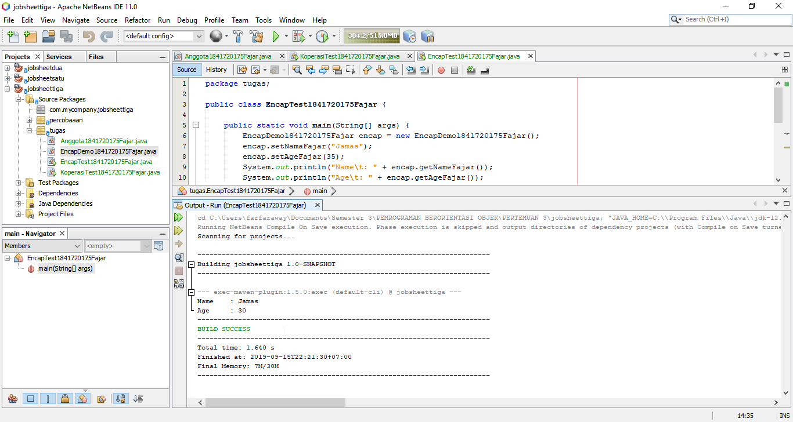

# Laporan Praktikum #3 - Enkapsulasi

## Kompetensi

Setelah melakukan percobaan pada modul ini mahasiswa memahami konsep:

* Konstruktor
* Akses modifier
* Atribut/method pada class
* Instansiasi atribut/method
* Setter dan getter
* Memahami notasi pada UML Class Diagram

## Ringkasan Materi

01. Enkapsulasi

    Enkapsulasi adalah metode untuk mengatur struktur pada class dengan tujuan untuk menentukan hak ases pada property atau method.
    
    
    

02. Konstruktor

    Konstruktor adalah method yang akan dieksekusi pada saat instansiasi suatu objek.
    
    
    

03. Akses Modifier

    Access Modifier adalah sebuah “hak akses” yang diberikan kepada sebuah variabel/method/class dengan tujuan untuk menjaga integritas dari data tersebut ketika ingin diakses object lain.
    
    
    
    

| Access Modifier | Within Class | Within Package | Outside Package by Subclass Only | Outside Package |
|-----------------|--------------|----------------|----------------------------------|-----------------|
| Private         | Y            | N              | N                                | N               |
| Default         | Y            | Y              | N                                | N               |
| Protected       | Y            | Y              | Y                                | N               |
| Public          | Y            | Y              | Y                                | Y               |

04. Getter dan Setter

    Getter dan setter adalah method yang digunakan untuk mengambil dan mengisi data.
    Getter dimulai dengan kata get diikuti nama variable. Setter mulai dengan set 
    diikuti dengan nama variabel.
    
    
    
    

05. Notasi UML Class Diagram

    Bentuk umum UML class diagram
    
    
    

    Notasi akses modifier pada UML class diagram adalah sebagai berikut:
    
    
    

    - Tanda plus (+) untuk public
    - Tanda pagar (#) untuk protected
    - Tanda minus (-) untuk private
    - Untuk default, maka tidak diberi notasi

    
    
    
    

## Percobaan

### Percobaan 1

Class Motor memiliki atribut kecepatan dan kontakOn, dan memiliki method printStatus() untuk menampilkan status motor.

Link kode program : [Link ke kode program](../../src/3_Enkapsulasi/percobaaan/Motor1841720175Fajar.java)

Link kode program : [Link ke kode main program](../../src/3_Enkapsulasi/percobaaan/MotorDemo1841720175Fajar.java)

### Percobaan 2

Penggunaan access modifier untuk memperbaiki cara kerja class Motor pada percobaan ke-1.

Link kode program : [Link ke kode program](../../src/3_Enkapsulasi/percobaaan/Motor1841720175Fajar.java)

Link kode program : [Link ke kode main program](../../src/3_Enkapsulasi/percobaaan/MotorDemo1841720175Fajar.java)

### Percobaan 3

Penggunaan getter dan setter untuk sistem informasi koperasi.

Link kode program : [Link ke kode program](../../src/3_Enkapsulasi/percobaaan/Anggota1841720175Fajar.java)

Link kode program : [Link ke kode main program](../../src/3_Enkapsulasi/percobaaan/KoperasiDemo1841720175Fajar.java)

### Percobaan 4

Penggunaan konstruktor untuk sistem informasi koperasi.

.png)

Link kode program : [Link ke kode program](../../src/3_Enkapsulasi/percobaaan/Anggota1841720175Fajar.java)

Link kode program : [Link ke kode main program](../../src/3_Enkapsulasi/percobaaan/KoperasiDemo1841720175Fajar.java)

## Pertanyaan

01. Pada class TestMotor, saat kita menambah kecepatan untuk pertama kalinya, mengapa muncul peringatan “Kecepatan tidak bisa bertambah karena Mesin Off!”?

    Karena pada method tambahKecepatanFajar() syarat menambah kecepatan adalah nilai
    variable mKontakOn adalah true, sedangkan nilai variable mKontakOn pada awal inisiasi adalah false.
    
    
    
    

02. Mengapat atribut kecepatan dan kontakOn diset private?

    Agar atribut-atribut tersebut tidak bisa diakses oleh class lain.
    
    
    
    

03. Ubah class Motor sehingga kecepatan maksimalnya adalah 100!

04. Apa yang dimaksud getter dan setter?

    Getter dan setter adalah method yang digunakan untuk mengambil dan mengisi data.
    Getter dimulai dengan kata get diikuti nama variable. Setter mulai dengan set 
    diikuti dengan nama variabel.
    
    
    
    

05. Apa kegunaan dari method getSimpanan()?

    Method getSimpanan() digunakan untuk mengembalikan nilai dari atribut simpanan.
    
    
    
    

06. Method apa yang digunakan untuk menambah saldo?

    Method yang digunakan untuk menambah saldo adalah method setorFajar().
    
    
    
    

07. Apa yand dimaksud konstruktor?

    Konstruktor adalah method yang akan dieksekusi pada saat instansiasi suatu objek.
    
    
    

    

08. Sebutkan aturan dalam membuat konstruktor?

* Nama konstruktor sama dengan nama class.
* Access modifier konstruktor bisa disesuaikan dengan kebutuhan.
* Konstrutor juga bisa diberi parameter.

09. Apakah boleh konstruktor bertipe private?

    Konstruktor boleh bertipe private agar objek hanya bisa diinstansiasi di dalam class tersebut saja.
    
    
    
    

10. Kapan menggunakan parameter dengan passsing parameter?

    Parameter dengan passing parameter digunakan ketika menginstansiasi objek dengan konstruktor berparamater.
    
    
    
    

11. Apa perbedaan atribut class dan instansiasi atribut?

    Atribut class adalah atribut yang terdapat pada suatu class. Sedangkan instansiasi atribut adalah proses pembuatan atribut pada suatu class.
    
    
    
    

12. Apa perbedaan class method dan instansiasi method?

    Class method adalah method yang terdapat pada suatu class. Sedangkan instansiasi atribut adalah proses pembuatan method pada suatu class.
    
    
    
    

## Tugas

01. Cobalah program dibawah ini dan tuliskan hasil outputnya!

Link kode program : [Link ke kode program](../../src/3_Enkapsulasi/tugas/EncapDemo1841720175Fajar.java)

Link kode program : [Link ke kode main program](../../src/3_Enkapsulasi/tugas/EncapTest1841720175Fajar.java)

02. Pada program diatas, pada class EncapTest kita mengeset age dengan nilai 35, namun pada saat ditampilkan ke layar nilainya 30, jelaskan mengapa.

    Karena pada method setAge(int newAge) memiliki syarat bahwa jika nilai newAge lebih dari 30 maka nilai variable age sama dengan 30.
    
    

03. Ubah program diatas agar atribut age dapat diberi nilai maksimal 30 dan minimal 18.

Link kode program : [Link ke kode program](../../src/3_Enkapsulasi/tugas/EncapDemo1841720175Fajar.java)

Link kode program : [Link ke kode main program](../../src/3_Enkapsulasi/tugas/EncapTest1841720175Fajar.java)

04. Pada sebuah sistem informasi koperasi simpan pinjam, terdapat class Anggota yang memiliki atribut antara lain nomor KTP, nama, limit peminjaman, dan jumlah pinjaman. Anggota dapat meminjam uang dengan batas limit peminjaman yang ditentukan. Anggota juga dapat mengangsur pinjaman. Ketika Anggota tersebut mengangsur pinjaman, maka jumlah pinjaman akan berkurang sesuai dengan nominal yang diangsur. Buatlah class Anggota tersebut, berikan atribut, method dan konstruktor sesuai dengan kebutuhan. Uji dengan TestKoperasi berikut ini untuk memeriksa apakah class Anggota yang anda buat telah sesuai dengan yang diharapkan.

Link kode program : [Link ke kode program](../../src/3_Enkapsulasi/tugas/Anggota1841720175Fajar.java)

Link kode program : [Link ke kode program](../../src/3_Enkapsulasi/tugas/KoperasiTest1841720175Fajar.java)

05. Modifikasi soal no.4 agar nominal yang dapat diangsur minimal adalah 10% dari jumlah pinjaman saat ini. Jika mengangsur kurang dari itu, maka muncul peringatan “Maaf, angsuran harus 10% dari jumlah pinjaman”.

Link kode program : [Link ke kode program](../../src/3_Enkapsulasi/tugas/Anggota1841720175Fajar.java)

Link kode program : [Link ke kode program](../../src/3_Enkapsulasi/tugas/KoperasiTest1841720175Fajar.java)

06. Modifikasi class TestKoperasi, agar jumlah pinjaman dan angsuran dapat menerima input dari console.

Link kode program : [Link ke kode program](../../src/3_Enkapsulasi/tugas/Anggota1841720175Fajar.java)

Link kode program : [Link ke kode program](../../src/3_Enkapsulasi/tugas/KoperasiTest1841720175Fajar.java)

## Kesimpulan

Enkapsulasi adalah metode untuk mengatur struktur pada class dengan cara memberikan access modifier yang sesuai dengan kebutuhan. Access Modifier adalah sebuah “hak akses” yang diberikan kepada sebuah variabel/method/class yang terdiri dari public, private, protected, dan default.

## Pernyataan Diri

Saya menyatakan isi tugas, kode program, dan laporan praktikum ini dibuat oleh saya sendiri. Saya tidak melakukan plagiasi, kecurangan, menyalin/menggandakan milik orang lain.

Jika saya melakukan plagiasi, kecurangan, atau melanggar hak kekayaan intelektual, saya siap untuk mendapat sanksi atau hukuman sesuai peraturan perundang-undangan yang berlaku.

Ttd, 

Fajar Pandu

