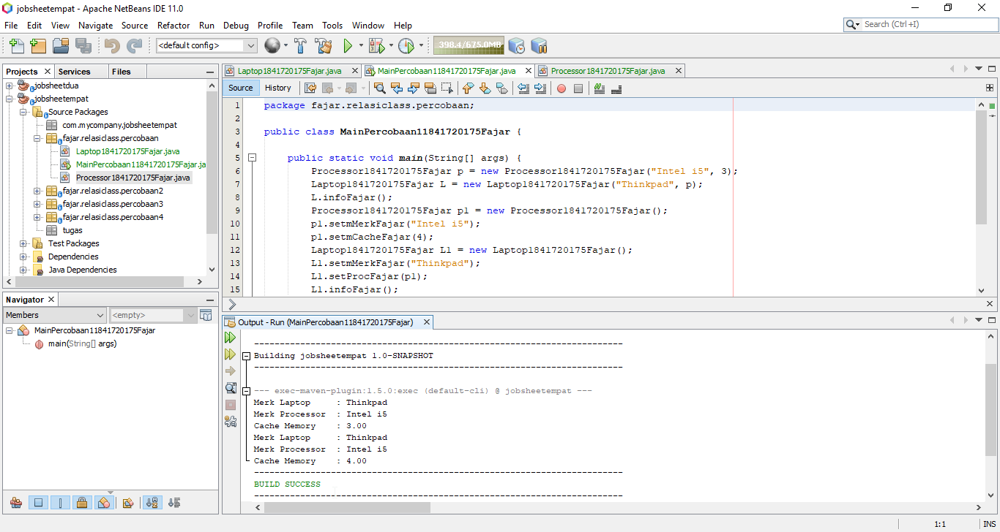
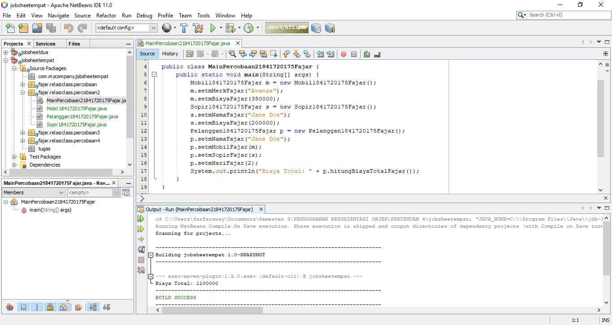
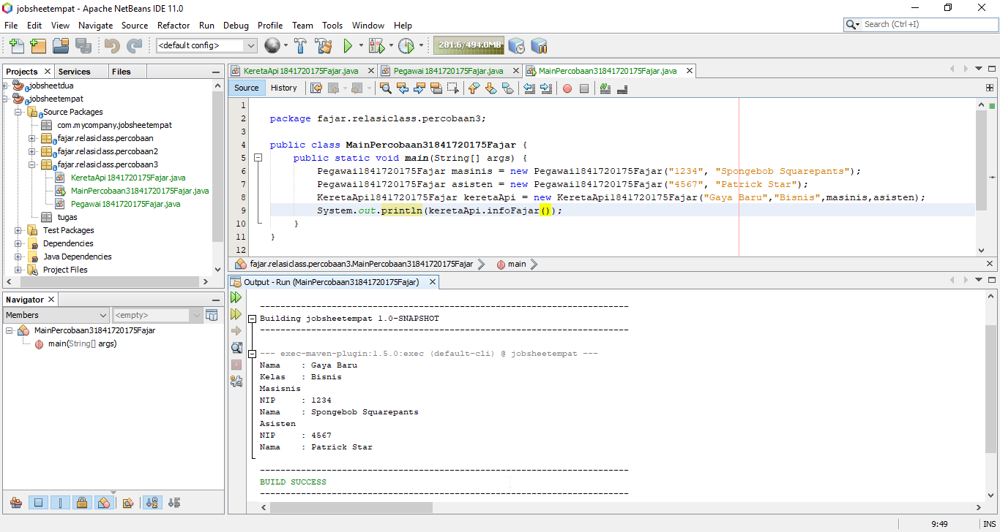
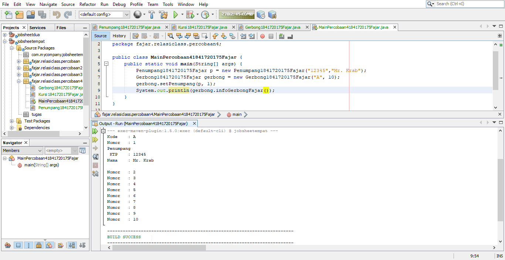
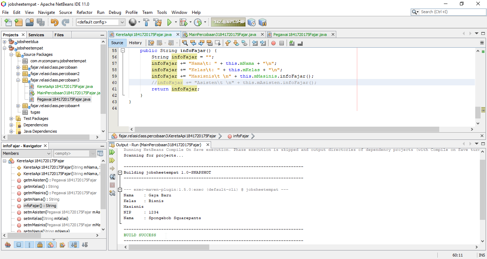
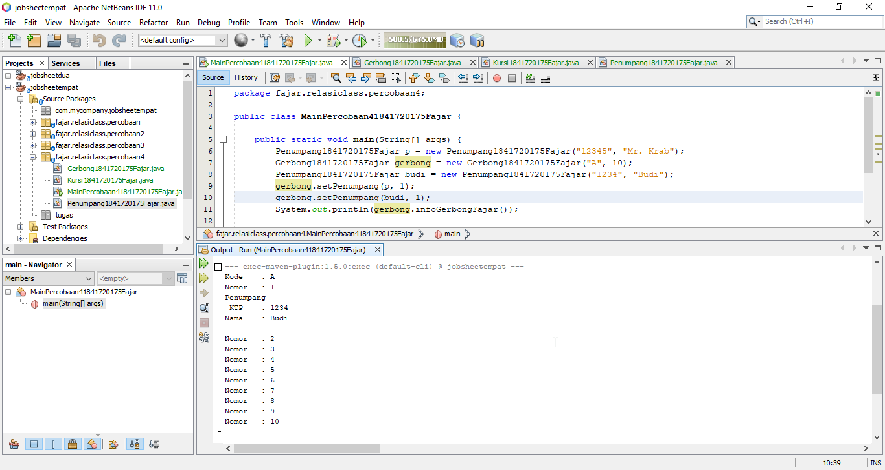
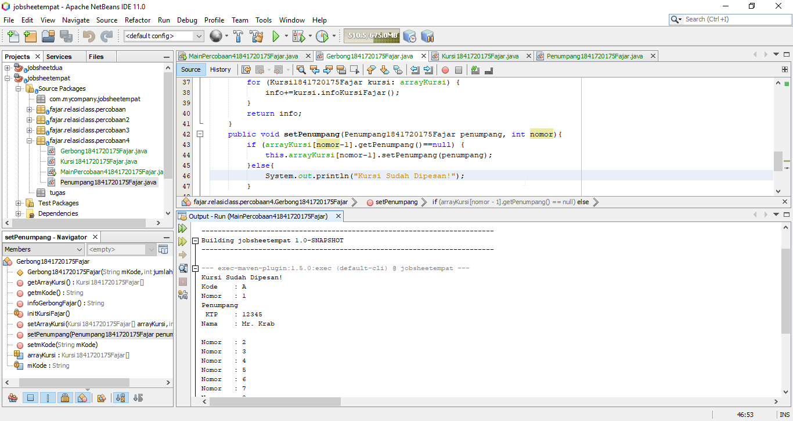
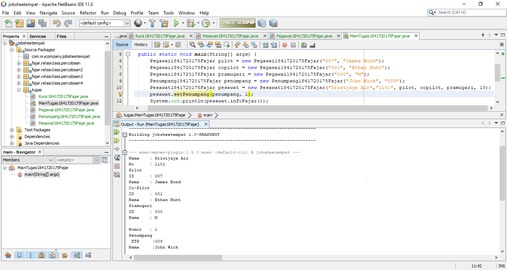

# Laporan Praktikum #4 - Relasi Kelas

## Kompetensi

Setelah menempuh pokok bahasan ini, mahasiswa mampu:

1. Memahami konsep relasi kelas.
2. Mengimplementasi relasi has-a dalam program.

## Ringkasan Materi

* Aggregation (*has-a*)

Aggregation atau agregasi adalah hubungan atau relasi antar kelas dalam java. Agregasi digambarkan dengan simbol belah ketupat yang ditempatkan pada kelas yang memiliki (*has-a*) dan tidak dibubuhkan simbol belah ketupat pada kelas yang dimiliki.

## Percobaan

### Percobaan 1

Link kode program : [Link ke kode program](../../src/4_Relasi_Class/fajar/relasiclass/percobaan/Laptop1841720175Fajar.java)

Link kode program : [Link ke kode program](../../src/4_Relasi_Class/fajar/relasiclass/percobaan/Processor1841720175Fajar.java)

Link kode main program : [Link ke kode program](../../src/4_Relasi_Class/fajar/relasiclass/percobaan/MainPercobaan11841720175Fajar.java)

### Percobaan 2

Link kode program : [Link ke kode program](../../src/4_Relasi_Class/fajar/relasiclass/percobaan2/Mobil1841720175Fajar.java)

Link kode program : [Link ke kode program](../../src/4_Relasi_Class/fajar/relasiclass/percobaan2/Pelanggan1841720175Fajar.java)

Link kode program : [Link ke kode program](../../src/4_Relasi_Class/fajar/relasiclass/percobaan2/Sopir1841720175Fajar.java)

Link kode main program : [Link ke kode program](../../src/4_Relasi_Class/fajar/relasiclass/percobaan2/MainPercobaan21841720175Fajar.java)

### Percobaan 3

Link kode program Kereta Api : [Link ke kode program](../../src/4_Relasi_Class/fajar/relasiclass/percobaan3/KeretaApi1841720175Fajar.java)

Link kode program Pegawai : [Link ke kode program](../../src/4_Relasi_Class/fajar/relasiclass/percobaan3/Pegawai1841720175Fajar.java)

Link kode main program : [Link ke kode program](../../src/4_Relasi_Class/fajar/relasiclass/percobaan3/MainPercobaan31841720175Fajar.java)

### Percobaan 4

Link kode program Gerbong : [Link ke kode program](../../src/4_Relasi_Class/fajar/relasiclass/percobaan4/Gerbong1841720175Fajar.java)

Link kode program Kursi : [Link ke kode program](../../src/4_Relasi_Class/fajar/relasiclass/percobaan4/Kursi1841720175Fajar.java)

Link kode program Penumpang : [Link ke kode program](../../src/4_Relasi_Class/fajar/relasiclass/percobaan4/Penumpang1841720175Fajar.java)

Link kode main program : [Link ke kode program](../../src/4_Relasi_Class/fajar/relasiclass/percobaan4/MainPercobaan41841720175Fajar.java)

## Pertanyaan

## Berdasarkan Percobaan 1 jawablah pertanyaan-pertanyan yang terkait:

1. Di dalam class Processor dan class Laptop, terdapat setter dan getter untuk masing-masing atributnya. Apakah gunanya method setter dan getter tersebut?

    Method setter digunakan untuk memberikan nilai pada varible yang terdapat pada class Processor dan class Laptop. Sedangkan method setter digunakan untuk me-*return* nilai variable pada class Processor dan class Laptop untuk digunakan kembali.

2. Di dalam class Processor dan class Laptop, masing-masing terdapat konstruktor default dan konstruktor berparameter. Bagaimanakah beda penggunaan dari kedua jenis konstruktor tersebut?

    Konstruktor default digunakan untuk meinstansiasi objek baru tanpa harus memberi nilai pada variable pada class tersebut. Sedangkan konstruktor berparameter digunakan untuk meinstansiasi objek baru dengan langsung memberi nilai pada variable apa saja sesuai dengan yang dicantumkan dalam konstruktor tersebut.

3. Perhatikan class Laptop, di antara 2 atribut yang dimiliki (merk dan proc), atribut manakah yang bertipe object ?

    Atribut yang bertipe objek adlah proc

4. Perhatikan class Laptop, pada baris manakah yang menunjukan bahwa class Laptop memiliki relasi dengan class Processor ?

    Ditandai dengan potongan kode berikut: 

* private Processor1841720175Fajar proc; 
*     public void infoFajar(){

        System.out.println("Merk Laptop\t: " + mMerk); 
        proc.infoFajar(); 

    }
    

5. Perhatikan pada class Laptop , Apakah guna dari sintaks proc.info() ?

    proc.info() digunakan untuk memanggil method info() pada class Processor untuk menampilkan merk processor dan besar cache memory

6. Pada class MainPercobaan1, terdapat baris kode:

    Laptop l = new Laptop("Thinkpad", p); . Apakah p tersebut ?

    p merupakan objek baru dari kelas processor.

    Dan apakah yang terjadi jika baris kode tersebut diubah menjadi:

    Laptop l = new Laptop("Thinkpad", new Processor("Intel i5", 3)); 

    Bagaimanakah hasil program saat dijalankan, apakah ada perubahan ?

    Program akan mengalami error karena pada pembuatan konstruktor kelas laptop diberikan parameter atribut berupa merk (String) dan proc (Processor).

## Berdasarkan Percobaan 2 jawablah pertanyaan-pertanyan yang terkait:

1. Perhatikan class Pelanggan. Pada baris program manakah yang menunjukan bahwa class Pelanggan memiliki relasi dengan class Mobil dan class Sopir ?

    Pada potongan kode berikut:

        private Mobil1841720175Fajar mMobil; 
        private Sopir1841720175Fajar mSopir; 

2. Perhatikan method hitungBiayaSopir pada class Sopir, serta method hitungBiayaMobil pada class Mobil. Mengapa menurut Anda method tersebut harus memiliki argument hari ?

    Karena rumus untuk menghitung total biaya sewa mobil ditambah sopir adalah jumlah biaya perhari dikali jumlah hari. Sehingga membutuhkan input nilai dari variable hari.

3. Perhatikan kode dari class Pelanggan. Untuk apakah perintah mobil.hitungBiayaMobil(hari) dan sopir.hitungBiayaSopir(hari) ?

    Perintah tersebut digunakan untuk menghitung total biaya yang akan dikeluarkan pelanggan.

4. Perhatikan class MainPercobaan2. Untuk apakah sintaks p.setMobil(m) dan p.setSopir(s) ?

    Sintak tersebut digunakan untuk menginisiasi nilai dari varibale yang bertipe objek pada kelas pelanggan.

5. Perhatikan class MainPercobaan2. Untuk apakah proses p.hitungBiayaTotal() tersebut ?

    Proses tersebut adalah proses pemanggilan method hitungBiayaTotal() pada kelas pelanggan 

6. Perhatikan class MainPercobaan2, coba tambahkan pada baris terakhir dari method main dan amati perubahan saat di‑run!

    System.out.println(p.getMobil().getMerk()); 

    Jadi untuk apakah sintaks p.getMobil().getMerk() yang ada di dalam method main tersebut?

    Sintak tersebut digunakan untuk mencetak nilai variable merk pada kelas mobil.

## Berdasarkan Percobaan 3 jawablah pertanyaan-pertanyan yang terkait:

1. Di dalam method info() pada class KeretaApi, baris this.masinis.info() dan this.asisten.info() digunakan untuk apa ?

    Sintak tersebut digunakan untuk menginisiasi nilai variable masinis dan asisten yang bertipe objek dengan memanggil method info() pada kelas pegawai.

2. Buatlah main program baru dengan nama class MainPertanyaan pada package yang sama. Tambahkan kode berikut pada method main() !

Pegawai masinis = new Pegawai("1234", "Spongebob Squarepants"); 
KeretaApi keretaApi = new KeretaApi("Gaya Baru", "Bisnis", masinis); 
System.out.println(keretaApi.info()); 

3. Apa hasil output dari main program tersebut ? Mengapa hal tersebut dapat terjadi ?

    Output main program tersebut adalah terjadi error

4. Perbaiki class KeretaApi sehingga program dapat berjalan !

## Berdasarkan Percobaan 4 jawablah pertanyaan-pertanyan yang terkait:

1. Pada main program dalam class MainPercobaan4, berapakah jumlah kursi dalam Gerbong A ?

    10 Kursi

2. Perhatikan potongan kode pada method info() dalam class Kursi. Apa maksud kode tersebut ?

...
if (this.penumpang != null) {
info += "Penumpang: " + penumpang.info() + "\n"; 
}
...

    Kode tersebut digunakan untuk mencetak data penumpang jika nilai atribut penumpang tidak kosong atau null.

3. Mengapa pada method setPenumpang() dalam class Gerbong, nilai nomor dikurangi dengan angka 1 ?

    Karena penomoran tersebut mengikuti aturan pada array java dimana indeks awal selalu dimulai dari angka 0.

4. Instansiasi objek baru budi dengan tipe Penumpang, kemudian masukkan objek baru tersebut pada gerbong dengan gerbong.setPenumpang(budi, 1). Apakah yang terjadi ?

    Nomor kursi 1 berubah kepemilikan dari Mr Krab menjadi Budi.

    

5. Modifikasi program sehingga tidak diperkenankan untuk menduduki kursi yang sudah ada penumpang lain !

   

## Tugas

 

Link kode program Kursi : [Link ke kode program](../../src/4_Relasi_Class/tugas/Kursi1841720175Fajar.java)

Link kode program Pegawai : [Link ke kode program](../../src/4_Relasi_Class/tugas/Pegawai1841720175Fajar.java)

Link kode program Penumpang : [Link ke kode program](../../src/4_Relasi_Class/tugas/Penumpang1841720175Fajar.java)

Link kode program Pesawat : [Link ke kode program](../../src/4_Relasi_Class/tugas/Pesawat1841720175Fajar.java)

Link kode main program : [Link ke kode program](../../src/4_Relasi_Class/tugas/MainTugas1841720175Fajar.java)

## Kesimpulan

Metode agregasi atau fungsi agregasi memudahkan penerapan OOP pada java sehingga programmer tidak perlu menulis banyak kode dalam satu kelas, tetapi dapat membuat beberapa kelas dan memberinya relasi atau hubungan sesuai dengan kebutuhan.

## Pernyataan Diri

Saya menyatakan isi tugas, kode program, dan laporan praktikum ini dibuat oleh saya sendiri. Saya tidak melakukan plagiasi, kecurangan, menyalin/menggandakan milik orang lain.

Jika saya melakukan plagiasi, kecurangan, atau melanggar hak kekayaan intelektual, saya siap untuk mendapat sanksi atau hukuman sesuai peraturan perundang-undangan yang berlaku.

Ttd, 

Fajar Pandu

