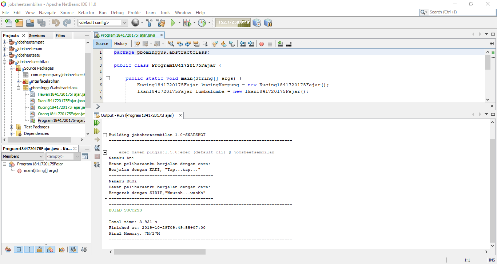
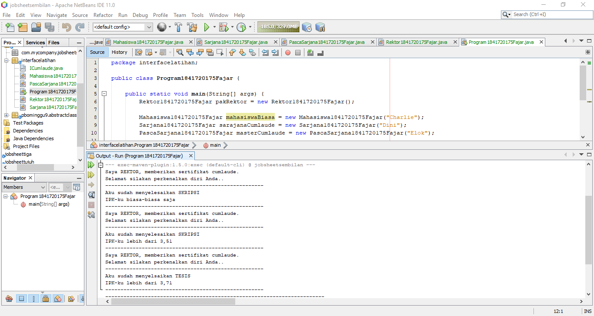
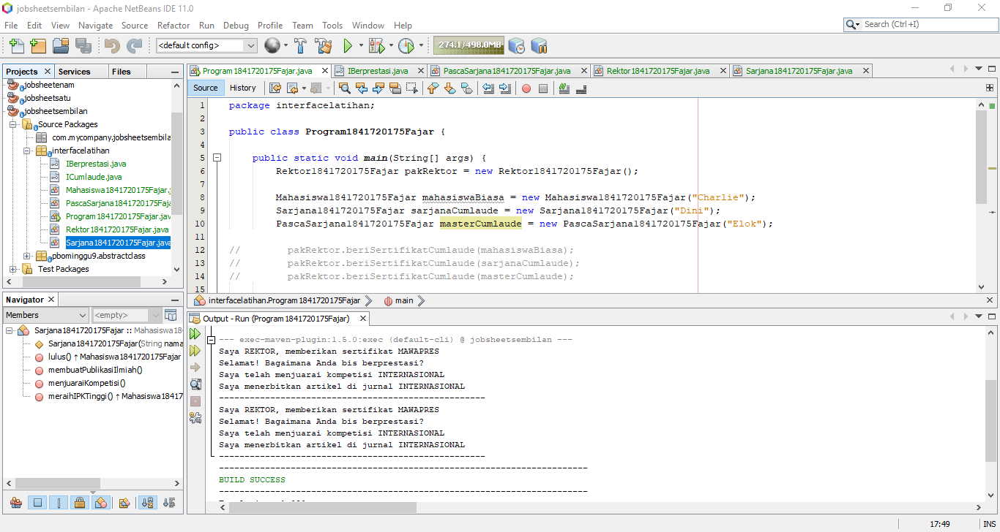
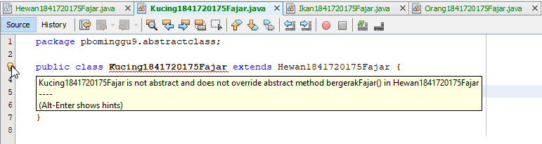
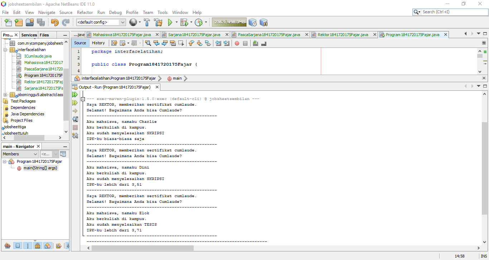

# Laporan Praktikum #9 - Abstract Class dan Interface

## Kompetensi

Setelah menyelesaikan lembar kerja ini mahsiswa diharapkan mampu:

1. Menjelaskan maksud dan tujuan penggunaan Abstract Class.

2. Menjelaskan maksud dan tujuan penggunaan Interface.

3. Menerapkan Abstract Class dan Interface di dalam pembuatan program.

## Ringkasan Materi

Abstract Class

Abstract Class adalah kelas yang berisi abstract method,atribut, atuapun method biasa. Abstract method adalah method yang dideklarasikan tanpa implementasi. Jika dalam sebuah class terdapat method abstract maka class tersebut wajib dideklarasikan sebagai method abstract. Ketika abstract class diturunkan maka subclassnya wajib mengimplementasi abstrct method dari superclassnya.

Interface

Interface adalah kelas yang hanya berisi abstract method saja. Interface digunakan dengan kata kunci implements setalah nama kelas yang akan menggunakan kelas interface.

## Percobaan

### Percobaan 1

Link kode program Hewan: [klik disini](../../src/9_Abstract_Class_dan_Interface/pbominggu9/abstractclass/Hewan1841720175Fajar.java)

Link kode program Ikan: [klik disini](../../src/9_Abstract_Class_dan_Interface/pbominggu9/abstractclass/Ikan1841720175Fajar.java)

Link kode program Kucing: [klik disini](../../src/9_Abstract_Class_dan_Interface/pbominggu9/abstractclass/Kucing1841720175Fajar.java)

Link kode program Orang: [klik disini](../../src/9_Abstract_Class_dan_Interface/pbominggu9/abstractclass/Orang1841720175Fajar.java)

Link kode program Orang: [klik disini](../../src/9_Abstract_Class_dan_Interface/pbominggu9/abstractclass/Program1841720175Fajar.java)

### Percobaan 2

Link kode program ICumlaude: [klik disini](../../src/9_Abstract_Class_dan_Interface/interfacelatihan/ICumlaude.java)

Link kode program Mahasiswa: [klik disini](../../src/9_Abstract_Class_dan_Interface/interfacelatihan/Mahasiswa1841720175Fajar.java)

Link kode program Sarjana: [klik disini](../../src/9_Abstract_Class_dan_Interface/interfacelatihan/Sarjana1841720175Fajar.java)

Link kode program Pasca Sarjana: [klik disini](../../src/9_Abstract_Class_dan_Interface/interfacelatihan/PascaSarjana1841720175Fajar.java)

Link kode program Rektor: [klik disini](../../src/9_Abstract_Class_dan_Interface/interfacelatihan/Rektor1841720175Fajar.java)

Link kode program Program: [klik disini](../../src/9_Abstract_Class_dan_Interface/interfacelatihan/Program1841720175Fajar.java)

### Percobaan 3

Link kode program IBerprestasi: [klik disini](../../src/9_Abstract_Class_dan_Interface/interfacelatihan/IIBerprestasi.java)

Link kode program ICumlaude: [klik disini](../../src/9_Abstract_Class_dan_Interface/interfacelatihan/ICumlaude.java)

Link kode program Mahasiswa: [klik disini](../../src/9_Abstract_Class_dan_Interface/interfacelatihan/Mahasiswa1841720175Fajar.java)

Link kode program Sarjana: [klik disini](../../src/9_Abstract_Class_dan_Interface/interfacelatihan/Sarjana1841720175Fajar.java)

Link kode program Pasca Sarjana: [klik disini](../../src/9_Abstract_Class_dan_Interface/interfacelatihan/PascaSarjana1841720175Fajar.java)

Link kode program Rektor: [klik disini](../../src/9_Abstract_Class_dan_Interface/interfacelatihan/Rektor1841720175Fajar.java)

Link kode program Program: [klik disini](../../src/9_Abstract_Class_dan_Interface/interfacelatihan/Program1841720175Fajar.java)

## Pertanyaan

1. Bolehkah apabila sebuah class meng-extand suatu abstract class tidak mengimplementasikan method abstract yang ada di class induknya? Buktikan!

    Tidak boleh. Kelas yang meng-extand kelas abstrak harus mengimplementasikan semua method abstrak yang ada.

    

2. Pertanyaan diskusi:

    a. Mengapa pada langkah nomor 9 terjadi error? Jelaskan!

    Pada langkah 9 terjadi error karena kelas Mahasiswa tidak mengimplent kelas interface ICumlaude.

    b. Dapatkah method kuliahDiKampus() dipanggil dari objek sarjanaCumlaude di class Program? Mengapa demikian?

    Method kuliahDiKampus() bisa dipanggil dari objek sarjanaCumlaude di class Program karena method tersebut memiliki akses modifier public sehingga bisa dipanggil dari luar kelas Sarjana.

    c. Dapatkah method kuliahDiKampus() dipanggil dari parameter mahasiswa di method beriSertifikatCumlaude() pada class Rektor? Mengapa demikian?

    d. Modifikasilah method beriSertifikatCumlaude() pada class Rektor

3. Apabila Sarjana Berprestasi harus menjuarai kompetisi NASIONAL dan menerbitkan artikel di jurnal NASIONAL, maka modifikasilah class-class yang terkait pada aplikasi Anda agar di class Program objek pakRektor dapat memberikan sertifikat mawapres pada objek sarjanaCumlaude

## Kesimpulan

Abstract class bersifat umum yang digunakan sebagai abstraksi untuk sebuah kelas yang lebih spesifik. Interface digunakan untuk diimplementasikan oleh banyak kelas.

## Pernyataan Diri

Saya menyatakan isi tugas, kode program, dan laporan praktikum ini dibuat oleh saya sendiri. Saya tidak melakukan plagiasi, kecurangan, menyalin/menggandakan milik orang lain.

Jika saya melakukan plagiasi, kecurangan, atau melanggar hak kekayaan intelektual, saya siap untuk mendapat sanksi atau hukuman sesuai peraturan perundang-undangan yang berlaku.

Ttd, 

Fajar Pandu

